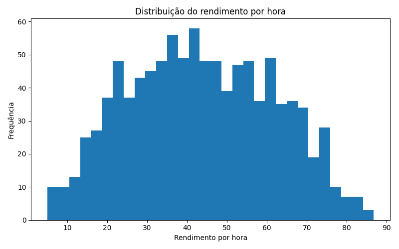
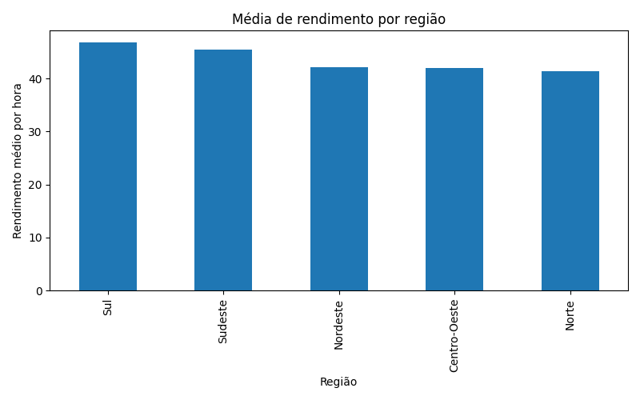
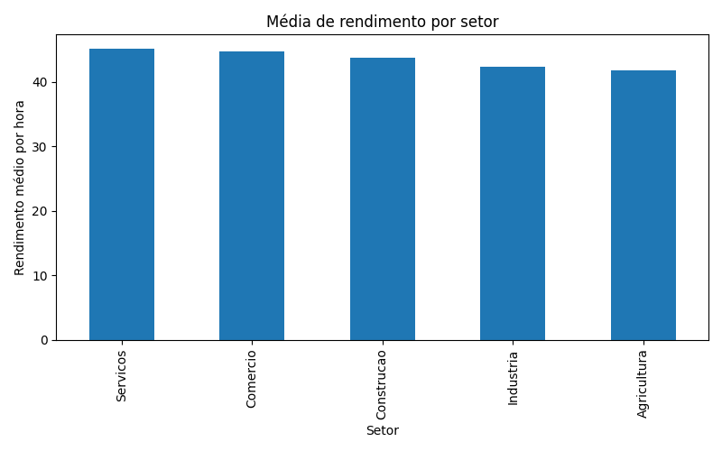
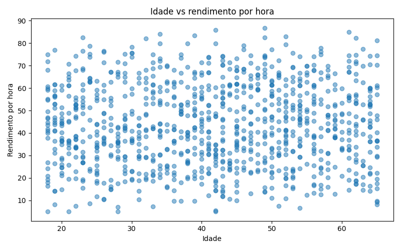

# Rendimento Predictor API

API REST desenvolvida com FastAPI para predizer rendimento por hora com base em características sociodemográficas e profissionais.

Este projeto combina Machine Learning, backend, testes automatizados, EDA, visualização de dados, Docker, CI/CD, deploy de API e frontend, simulando um fluxo completo de desenvolvimento de uma aplicação preditiva.

## Aplicação Web

Frontend publicado no Streamlit Cloud:

```txt
https://rendimento-predictor-api.streamlit.app/
```

A interface permite:

- preencher dados para predição;
- consultar o modelo de produção usado por `/predict`;
- consultar o modelo candidato do pipeline real;
- consultar o modelo de produção treinado com PNAD real;
- visualizar métricas dos modelos;
- visualizar importância das variáveis, incluindo o modelo de produção PNAD real;
- comparar Regressão Linear, Random Forest e XGBoost;
- visualizar histórico de predições;
- visualizar informações gerais do projeto.

## Deploy da API

A API está disponível publicamente em:

```txt
https://rendimento-predictor-api.onrender.com/
```

Documentação interativa Swagger:

```txt
https://rendimento-predictor-api.onrender.com/docs
```

Health check:

```txt
https://rendimento-predictor-api.onrender.com/health
```

Métricas básicas da aplicação:

```txt
https://rendimento-predictor-api.onrender.com/metrics
```

Informações do modelo legado:

```txt
https://rendimento-predictor-api.onrender.com/model-info
```

Informações do modelo candidato do pipeline real:

```txt
https://rendimento-predictor-api.onrender.com/model-info/real
```

Informações do modelo de produção treinado com PNAD real:

```txt
https://rendimento-predictor-api.onrender.com/model-info/production
```

Comparação de modelos:

```txt
https://rendimento-predictor-api.onrender.com/model-comparison
```

Importância das variáveis do modelo legado:

```txt
https://rendimento-predictor-api.onrender.com/feature-importance
```

Importância das variáveis do modelo candidato:

```txt
https://rendimento-predictor-api.onrender.com/feature-importance/real
```

Importância das variáveis do modelo de produção PNAD real:

```txt
https://rendimento-predictor-api.onrender.com/feature-importance/production
```

Histórico de predições:

```txt
https://rendimento-predictor-api.onrender.com/history
```

## Objetivo

Construir uma aplicação capaz de receber dados como idade, sexo, cor/raça, anos de estudo, setor e região, e retornar uma estimativa de rendimento por hora.

## Melhorias recentes

- v2.7 — Centralização de constantes em core/config.py e redução de duplicação entre API, frontend e testes.
- v2.6 — Endpoint /metadata para integração, frontend consumindo metadados da API e testes de fallback.
- v2.5 — Observabilidade básica com /metrics, health check informativo e métricas do modelo em produção.
- v2.4 — Validação robusta do input do /predict, documentação OpenAPI enriquecida e testes para payloads inválidos.
- v2.3 — Contratos explícitos da API com Pydantic, documentação OpenAPI mais precisa e testes de contrato.
- v2.2 — Robustez em produção, rate limiting e feature importance do modelo de produção.

## Tecnologias utilizadas

- Python
- FastAPI
- Streamlit
- Scikit-learn
- XGBoost
- Pandas
- NumPy
- Matplotlib
- Joblib
- Pytest
- GitHub Actions
- Docker
- Render
- Streamlit Cloud

## Endpoints

### Health check

```http
GET /health
```

Retorna o status da API.

### Métricas da aplicação

```http
GET /metrics
```

Retorna métricas básicas de observabilidade da API, incluindo nome da aplicação, status, modelo em produção, total de predições salvas no histórico e métricas do modelo de produção (`model_rmse`, `model_mae` e `model_r2`).

### Metadados da API

```http
GET /metadata
```

Retorna metadados para integração com clientes externos e frontend, incluindo `app_name`, `version`, `model_name`, `prediction_endpoint`, `numeric_constraints` e `categorical_options`.

### Features

```http
GET /features
```

Retorna as variáveis aceitas pelo modelo.

### Informações do modelo legado

```http
GET /model-info
```

Retorna métricas e informações do modelo legado sintético, mantido como baseline histórico.

### Informações do modelo candidato

```http
GET /model-info/real
```

Retorna métricas e informações do modelo candidato treinado pelo pipeline real anterior.

### Informações do modelo de produção

```http
GET /model-info/production
```

Retorna métricas e informações do modelo XGBoost treinado com microdados reais da PNAD Contínua 2023 trimestre 1.

### Comparação de modelos

```http
GET /model-comparison
```

Retorna a comparação entre os modelos treinados no pipeline:

- Regressão Linear
- Random Forest
- XGBoost

A comparação inclui RMSE, MAE, R², média de R² em validação cruzada e desvio padrão da validação cruzada.

### Importância das variáveis do modelo legado

```http
GET /feature-importance
```

Retorna as variáveis mais importantes para o modelo legado atualmente usado pela API.

### Importância das variáveis do modelo candidato

```http
GET /feature-importance/real
```

Retorna as variáveis mais importantes para o modelo candidato treinado pelo pipeline real.

### Importância das variáveis do modelo de produção

```http
GET /feature-importance/production
```

Retorna a importância das variáveis do modelo XGBoost `xgboost_pnad_real_production_v1`, treinado com microdados reais da PNAD Contínua.

### Predição

```http
POST /predict
```

Retorna a predição de rendimento por hora usando o modelo real de produção `xgboost_pnad_real_production_v1`.
O campo `intervalo_confianca` mantém o mesmo formato da API, mas agora é estimado
com percentis 5 e 95 dos resíduos observados no conjunto de teste do modelo de
produção. Esse intervalo é empírico e baseado em resíduos; ainda não é uma
abordagem de quantile regression nem bootstrap.

Em caso de falha interna ao gerar a predição, a API retorna uma mensagem amigável.
Falhas ao salvar o histórico no banco não impedem o retorno da predição e geram rollback da transação.
O endpoint possui rate limiting simples de 30 requisições por minuto por IP; ao
exceder o limite, a API retorna HTTP 429.

Exemplo de entrada:

```json
{
  "idade": 35,
  "sexo": "M",
  "cor_raca": "Branca",
  "anos_estudo": 12,
  "setor": "Servicos",
  "regiao": "Sudeste"
}
```

Exemplo de saída:

```json
{
  "rendimento_hora_previsto": 50.48,
  "intervalo_confianca": {
    "min": 42.9,
    "max": 58.05
  },
  "features_usadas": {
    "idade": 35,
    "sexo": "M",
    "cor_raca": "Branca",
    "anos_estudo": 12,
    "setor": "Servicos",
    "regiao": "Sudeste"
  },
  "modelo": "xgboost_pnad_real_production_v1"
}
```

### Histórico de predições

```http
GET /history
```

Retorna as últimas predições salvas no banco SQLite. O endpoint aceita o parâmetro opcional `limit`, com valor padrão `10`.

Exemplo:

```http
GET /history?limit=10
```

Exemplo de saída:

```json
{
  "total_returned": 1,
  "predictions": [
    {
      "id": 1,
      "idade": 35,
      "sexo": "M",
      "cor_raca": "Branca",
      "anos_estudo": 12,
      "setor": "Servicos",
      "regiao": "Sudeste",
      "rendimento_hora_previsto": 50.48,
      "intervalo_confianca": {
        "min": 42.9,
        "max": 58.05
      },
      "modelo": "xgboost_pnad_real_production_v1",
      "created_at": "2026-05-09T12:00:00"
    }
  ]
}
```

## Banco de dados e histórico

O projeto usa SQLite local para registrar as predições realizadas pela API.

- Arquivo local do banco: `data/predictions.db`
- Esse arquivo é ignorado pelo Git.
- Cada chamada para `POST /predict` salva uma nova predição.
- O endpoint `GET /history` consulta as últimas predições salvas.
- Não há Alembic nesta etapa; a tabela é criada automaticamente ao iniciar a API ou manualmente com `python -m database.init_db`.

## Robustez da API

O carregamento do modelo de produção possui tratamento explícito para arquivo ausente ou falha de desserialização. Durante o `POST /predict`, falhas internas do modelo são convertidas em erro amigável para o cliente.

A persistência do histórico é isolada da predição: se o banco falhar ao salvar o registro, a transação é revertida e a API ainda retorna a predição calculada.

O endpoint `POST /predict` também possui rate limiting simples em memória: 30 requisições por minuto por IP. Endpoints de leitura, como `/health`, `/model-info`, `/history` e feature importance, não são limitados.

## Observabilidade

A API possui observabilidade básica por meio dos endpoints `GET /health` e `GET /metrics`. O health check retorna informações úteis para produção, incluindo `app_name`, `status`, `model_loaded`, `database_connected`, `model_name` e `version`.

O endpoint `GET /metrics` expõe `app_name`, `status`, `model_name`, `total_predictions`, `model_rmse`, `model_mae` e `model_r2`. A contagem `total_predictions` vem do banco de histórico, enquanto as métricas do modelo usam a mesma fonte do endpoint `/model-info/production`.

Se houver falha ao acessar o banco durante a contagem de predições, `/metrics` responde de forma controlada com `status` igual a `degraded`, `total_predictions` igual a `0` e rollback da transação.

## Integração com clientes

O endpoint `GET /metadata` expõe os limites numéricos aceitos pelo `POST /predict` (`idade` de 14 a 100 e `anos_estudo` de 0 a 20), além das opções categóricas aceitas para `sexo`, `cor_raca`, `setor` e `regiao`.

O frontend Streamlit consome `/metadata` para configurar os controles de idade, anos de estudo e categorias. Se `/metadata` falhar, o app mantém fallback local com os mesmos limites e categorias, evitando que a interface deixe de funcionar.

## Configuração centralizada

As principais constantes da aplicação ficam centralizadas em `core/config.py`, incluindo `APP_NAME`, `APP_VERSION`, limites numéricos e opções categóricas usadas pelo `POST /predict`.

Essas constantes são reutilizadas pelo backend, pelo frontend e pelos testes, reduzindo duplicação entre `/features`, `/metadata`, `/health`, `/metrics`, schemas Pydantic e fallback local do Streamlit. A mudança não altera o comportamento da API; apenas torna limites e categorias mais fáceis de manter.

## Contratos da API

A API possui contratos de resposta explícitos com Pydantic para os principais endpoints. O `POST /predict` usa `PredictionOutput`, com `intervalo_confianca` e `features_usadas` tipados. Os endpoints `/health`, `/metrics`, `/metadata`, `/model-info`, `/model-info/real`, `/model-info/production`, `/model-comparison` e `/history` também possuem `response_model` dedicado.

O input do `POST /predict` também possui validação explícita via `PredictionInput`: `idade` aceita valores de 14 a 100, `anos_estudo` aceita valores de 0 a 20, e campos categóricos como `sexo`, `cor_raca`, `setor` e `regiao` aceitam apenas categorias suportadas pelo modelo e pelo frontend. Entradas inválidas, campos obrigatórios ausentes, tipos incorretos, categorias inválidas e limites numéricos fora da faixa são rejeitados com HTTP 422.

Com isso, a documentação automática em `/docs` e `/openapi.json` fica mais precisa para integração com frontend, clientes externos e manutenção. Os contratos principais são cobertos por testes automatizados, incluindo validações do OpenAPI.

## Modelo atual

O modelo atual em produção é `xgboost_pnad_real_production_v1`, treinado com microdados reais da PNAD Contínua 2023 trimestre 1.

```txt
Modelo: xgboost_pnad_real_production_v1
Algoritmo: XGBoost
Dados: PNAD Contínua 2023 trimestre 1
Linhas finais após limpeza: 175.132
RMSE: 5.86
MAE: 4.34
R²: 0.333
Método de intervalo: residual_percentile_5_95
```

Esse é o modelo carregado pelo endpoint `POST /predict`.

## Modelo legado

O modelo legado é um baseline treinado com dados sintéticos, mantido como histórico do projeto e como referência de evolução do pipeline:

Métricas do modelo legado:

```txt
RMSE: 6.42
MAE: 4.99
R²: 0.861
```

## Modelo de produção

O modelo de produção foi treinado com microdados reais da PNAD Contínua 2023 trimestre 1, a partir do arquivo de largura fixa oficial e do layout SAS.

```txt
Modelo: xgboost_pnad_real_production_v1
Algoritmo: XGBoost
Dados: PNAD Contínua 2023 trimestre 1
Linhas lidas pelo parser: 473.335
Linhas finais após limpeza: 175.132
RMSE: 5.86
MAE: 4.34
R²: 0.333
```

Artefatos gerados:

```txt
data/processed/pnad_real_processed.csv
data/models/rendimento_model_production.pkl
data/models/metrics_production.json
```

As métricas desse modelo estão disponíveis em:

```http
GET /model-info/production
```

## Comparação de modelos

O projeto compara três abordagens de modelagem sobre o dataset real processado da PNAD:

```txt
Regressão Linear
Random Forest
XGBoost
```

Resultado atual da comparação:

```txt
Melhor modelo por RMSE: xgboost

linear_regression → RMSE 6.16 | MAE 4.64 | R² 0.263
random_forest     → RMSE 5.90 | MAE 4.37 | R² 0.325
xgboost           → RMSE 5.86 | MAE 4.34 | R² 0.333
```

A comparação é gerada por:

```bash
python -m ml.compare_models
```

E salva em:

```txt
data/models/model_comparison.json
```

## Pipeline de dados reais

O projeto possui um pipeline para transformar microdados reais da PNAD Contínua em um dataset tabular usado no treinamento dos modelos.

Arquivos principais:

```txt
scripts/download_pnad.py
scripts/extract_pnad_zip.py
scripts/inspect_pnad_input.py
scripts/parse_pnad_real.py
scripts/prepare_real_data.py
scripts/eda_real.py
ml/train_real.py
ml/compare_models.py
ml/train_production.py
```

O parser real lê o arquivo de largura fixa da PNAD usando as posições do layout SAS:

```txt
data/raw/pnad/input_PNADC_trimestre1.txt
data/raw/pnad/extracted/PNADC_2023_trimestre1/PNADC_2023_trimestre1.txt
```

E gera:

```txt
data/processed/pnad_real_processed.csv
data/processed/real_eda_summary.txt
data/processed/real_plots/
data/models/rendimento_model_real.pkl
data/models/metrics_real.json
data/models/model_comparison.json
data/models/rendimento_model_production.pkl
data/models/metrics_production.json
```

O objetivo é separar claramente:

```txt
modelo legado → baseline sintético histórico
modelo candidato → treinado pelo pipeline real e exposto em /model-info/real
modelo de produção → XGBoost treinado com PNAD real, usado em /predict e exposto em /model-info/production
comparação → modelos avaliados e expostos em /model-comparison
```

## Importância das variáveis

O projeto expõe a importância das variáveis dos modelos legado, candidato e de produção. O frontend Streamlit consome a feature importance do modelo de produção para refletir o mesmo modelo usado pelo `POST /predict`.

Para o modelo legado:

```bash
GET /feature-importance
```

Para o modelo candidato:

```bash
GET /feature-importance/real
```

Para o modelo de produção:

```bash
GET /feature-importance/production
```

Esses endpoints ajudam a entender quais variáveis mais influenciam a predição, como idade, anos de estudo, região, setor, sexo e cor/raça.

## Dados sintéticos e EDA

Antes da integração com dados reais do IBGE/PNAD, o projeto utilizava um dataset sintético para validar o fluxo completo de Machine Learning e API.

O dataset sintético é gerado por:

```bash
python -m scripts.generate_data
```

Esse comando cria o arquivo:

```txt
data/processed/synthetic_rendimento.csv
```

A análise exploratória inicial pode ser gerada com:

```bash
python -m scripts.eda_synthetic
```

Esse comando cria o relatório:

```txt
data/processed/eda_summary.txt
```

A EDA inclui:

- shape do dataset
- tipos das variáveis
- valores ausentes
- estatísticas descritivas
- distribuição por sexo
- distribuição por região
- média de rendimento por região
- média de rendimento por setor
- gráficos exploratórios em PNG

## Visualizações da EDA

### Distribuição do rendimento por hora



### Média de rendimento por região



### Média de rendimento por setor



### Idade vs rendimento por hora



## Como rodar localmente

Clone o repositório:

```bash
git clone https://github.com/justmetro/rendimento-predictor-api.git
cd rendimento-predictor-api
```

Crie e ative o ambiente virtual:

```bash
python -m venv venv
venv\Scripts\activate
```

Instale as dependências:

```bash
pip install -r requirements.txt
```

Gere os dados sintéticos:

```bash
python -m scripts.generate_data
```

Gere a EDA inicial:

```bash
python -m scripts.eda_synthetic
```

Treine o modelo sintético:

```bash
python ml/train.py
```

Prepare os dados reais padronizados:

```bash
python -m scripts.prepare_real_data
```

Gere a EDA dos dados reais padronizados:

```bash
python -m scripts.eda_real
```

Treine o modelo candidato do pipeline real:

```bash
python -m ml.train_real
```

Parseie os microdados reais da PNAD Contínua 2023 trimestre 1:

```bash
python -m scripts.parse_pnad_real data/raw/pnad/extracted/PNADC_2023_trimestre1/PNADC_2023_trimestre1.txt
```

Compare os modelos:

```bash
python -m ml.compare_models
```

Treine o modelo de produção com PNAD real:

```bash
python -m ml.train_production
```

Inicialize o banco SQLite, se quiser criar a tabela manualmente:

```bash
python -m database.init_db
```

O banco também é criado automaticamente ao iniciar a API.

Rode a API:

```bash
uvicorn main:app --reload
```

Acesse a documentação automática:

```txt
http://127.0.0.1:8000/docs
```

## Como rodar o frontend localmente

Rode:

```bash
streamlit run frontend/app_streamlit.py
```

Ou:

```bash
python -m streamlit run frontend/app_streamlit.py
```

Acesse:

```txt
http://localhost:8501
```

Por padrão, o frontend local usa a API em:

```txt
http://localhost:8000
```

O formulário de predição usa `GET /metadata` para carregar limites e opções aceitos pela API. Caso esse endpoint não esteja disponível, o frontend usa fallback local com os mesmos valores esperados pelo backend.

Em produção, configure a URL da API por variável de ambiente ou secret do Streamlit Cloud:

```txt
API_URL = "https://rendimento-predictor-api.onrender.com"
```

## Como rodar com Docker

Construa a imagem:

```bash
docker build -t rendimento-predictor-api .
```

Rode o container:

```bash
docker run -p 8000:8000 rendimento-predictor-api
```

Acesse:

```txt
http://127.0.0.1:8000/docs
```

## Testes

Para rodar os testes:

```bash
pytest
```

Os testes usam um banco SQLite isolado em `data/test_predictions.db`. Esse arquivo é ignorado pelo Git.

Para rodar com cobertura:

```bash
pytest --cov=.
```

## CI/CD

O projeto usa GitHub Actions para rodar os testes automaticamente a cada push na branch `main`.

## Deploy

- Backend/API: Render
- Frontend: Streamlit Cloud

No Streamlit Cloud, configure os secrets para apontar o frontend para a API publicada no Render:

```toml
API_URL = "https://rendimento-predictor-api.onrender.com"
APP_ENV = "production"
```

## Próximos passos

- Aprofundar análise exploratória dos microdados reais
- Melhorar feature engineering
- Melhorar a interface web
